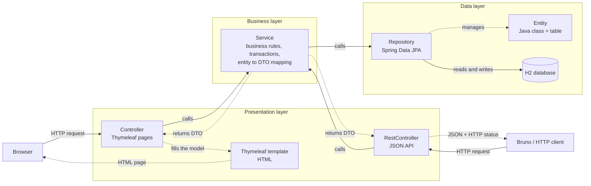
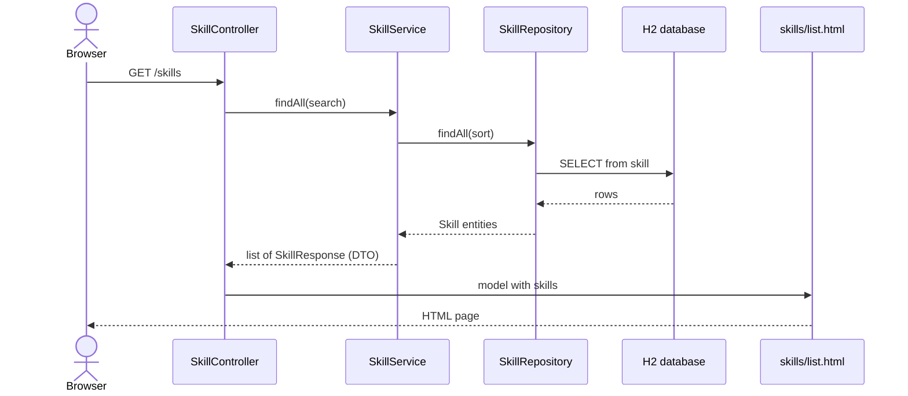

## 4. Architecture en couches (MVC)

```mermaid
flowchart LR
    Browser["Browser"]
    Bruno["Bruno / HTTP client"]

    subgraph Presentation["Presentation layer"]
        Controller["Controller<br/>Thymeleaf pages"]
        RestController["RestController<br/>JSON API"]
        Template["Thymeleaf template<br/>HTML"]
    end

    subgraph Business["Business layer"]
        Service["Service<br/>business rules, transactions,<br/>entity to DTO mapping"]
    end

    subgraph Data["Data layer"]
        Repository["Repository<br/>Spring Data JPA"]
        Entity["Entity<br/>Java class = table"]
        DB[("H2 database")]
    end

    Browser -->|"HTTP request"| Controller
    Bruno -->|"HTTP request"| RestController

    Controller -->|"calls"| Service
    RestController -->|"calls"| Service
    Service -->|"calls"| Repository
    Repository -->|"reads and writes"| DB
    Repository -.->|"manages"| Entity

    Service -.->|"returns DTO"| Controller
    Service -.->|"returns DTO"| RestController
    Controller -.->|"fills the model"| Template
    Template -.->|"HTML page"| Browser
    RestController -.->|"JSON + HTTP status"| Bruno
```

### Exemple : afficher la liste des compétences

```mermaid
sequenceDiagram
    actor User as Browser
    participant C as SkillController
    participant S as SkillService
    participant R as SkillRepository
    participant DB as H2 database
    participant T as skills/list.html

    User->>C: GET /skills
    C->>S: findAll(search)
    S->>R: findAll(sort)
    R->>DB: SELECT from skill
    DB-->>R: rows
    R-->>S: Skill entities
    S-->>C: list of SkillResponse (DTO)
    C->>T: model with skills
    T-->>User: HTML page
```